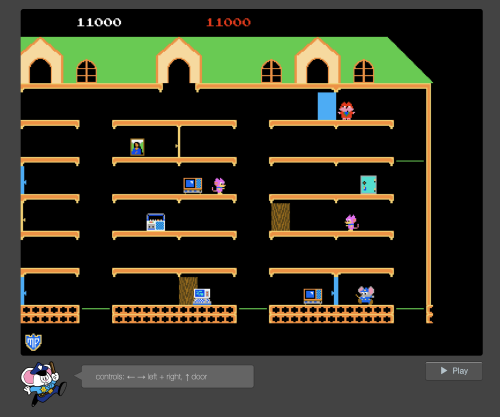

# Mappy clone for the browser in Web Assembly

*play the [game](http://kippl.net/mappy/)*
<br>
<br>
[](http://kippl.net/mappy/)


##### Compile arguments:

```em++ main.cpp -o index.html --shell-file shell.html --emrun --preload-file audio -s WASM=1 -s USE_SDL=2 -std=c++11 -s ALLOW_MEMORY_GROWTH=1 -s USE_SDL_MIXER=2 -s NO_EXIT_RUNTIME=1 -s EXPORTED_FUNCTIONS="['_startButton', '_main']" -s EXTRA_EXPORTED_RUNTIME_METHODS="['cwrap','ccall']" -s ENVIRONMENT='web' -O3```